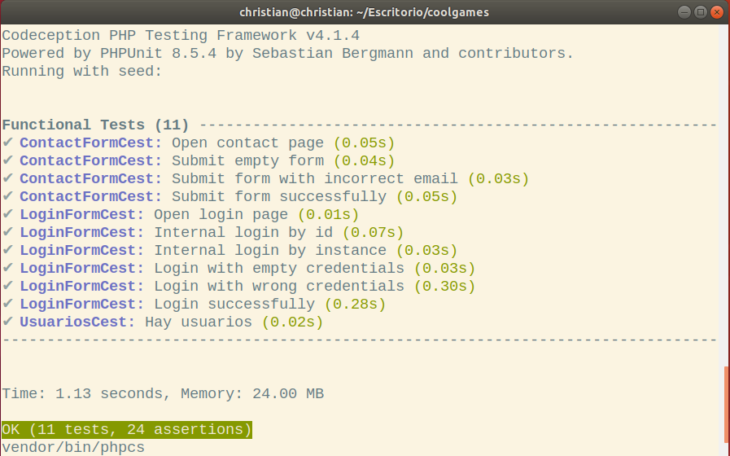
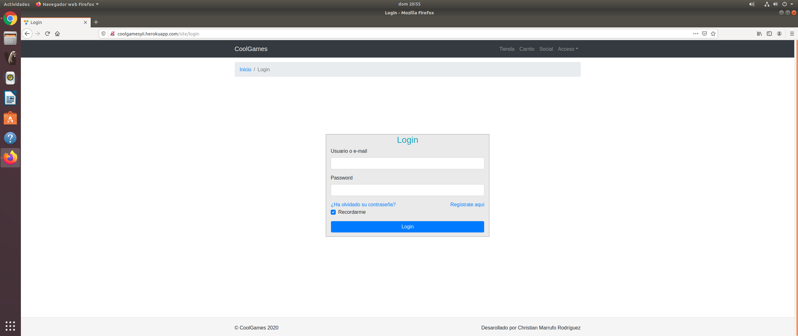

# Anexos

---
### **([R25](https://github.com/cmarrufo97/coolgames/issues/25)) Codeception**

---

### **([R36](https://github.com/cmarrufo97/coolgames/issues/36)) Varios Navegadores**

#### Microsoft Edge

#### Chrome

#### Mozilla Firefox

#### Opera

---

### **([R34](https://github.com/cmarrufo97/coolgames/issues/34)) Validación HTML5, CSS3 y accesibilidad**

### Validación HTML5

[Enlace a la validación HTML5](https://validator.w3.org/nu/?doc=http%3A%2F%2Fcoolgamesyii.herokuapp.com%2F)

### Validación CSS3

[Enlace a la validación CSS3](https://jigsaw.w3.org/css-validator/validator?uri=http%3A%2F%2Fcoolgamesyii.herokuapp.com%2F&profile=css3svg&usermedium=all&warning=1&vextwarning=&lang=es)

Nota: La imagen aparece sin errores ya que ha sido cargado el css principal de la página princiapl (site.css). Mediante el enlace muestra errores, pero dichos errores son causados por los assets de bootstrap que genera el framework yii2.

### Validación de accesibilidad

[Enlace a la validación de accesibilidad](https://achecker.ca/checker/index.php)

### Prueba del seis

<ol>
<li>¿Qué sitio es éste?</li>
<ul>
<li>
La página web tiene muestra elementos indicativos en donde se está en cada momento. Arriba, en la barra de navegación se sitúa el nombre de la página web, al igual que en el footer. La barra de navegación y el footer son persistentes por lo que se identifica el sitio en todo momento.
</li>
</ul>
 
<li>¿En qué página estoy?</li>
<ul>
<li>Todas las páginas de la página están identificadas por migas de pan, por lo tanto te situan siempre</li>
</ul>
 
<li>¿Cuáles son las principales secciones del sitio?</li>
<ul>
<li>
Las secciones principales de la página web son: Tienda, Mi Biblioteca, Social, Mi Perfil, Carrito, Deseados (para usuarios normales que esten logueados) y para los admins, ademas de lo anterior, las secciones: Usuarios, Géneros y Juegos.
</li>
</ul>
 

<li>¿Qué opciones tengo en este nivel?</li>
<ul>
<li>
En la sección para admins (Usuarios, Géneros y Juegos): aquellos usuarios que tengan como rol admin podrán gestionar lo mencionado anteriormente, los usuarios, generos y juegos.

<li>
En la seccion Social los usuarios pueden buscar a otros usuarios y añadirlos como amigos, ademas de chatear en tiempo real con sus amigos, ver el perfil de sus amigos, eliminar amigos.

<li>En Mi Biblioteca aparecen los juegos comprados por el usuario logueado, que puede descargar. 

<li>En Tienda los usuarios pueden ver todos los juegos disponibles en la aplicación, comprarlos, añadir a deseados y al carrito, y ademas ir a la páginad de comentarios de ese juego.

<li>En Deseados puedes ver los juegos añadidos como juegos deseados.

<li>En Carrito puedes ver los juegos agregados al carrito, en el cual sale el total a pagar.

<li>En Mi Perfil puedes consultar/modificar datos de tu cuenta, cambiar la foto de perfil, y ver los comentarios recibidos por parte de otros usuarios.
</li>
</li>
</ul>
 

<li>¿Dónde estoy en el esquema de las cosas?</li>
<ul>
<li> Arriba de todas las paginas, en la zona superior están las migas de pan que te indican en el sitio que te situas actualmente.</li>
</ul>
<li>¿Cómo busco algo?</li>
<ul>
<li>
TODO: SEGUIR EXPLICANDOLO
</li>
</ul>
</ol>

